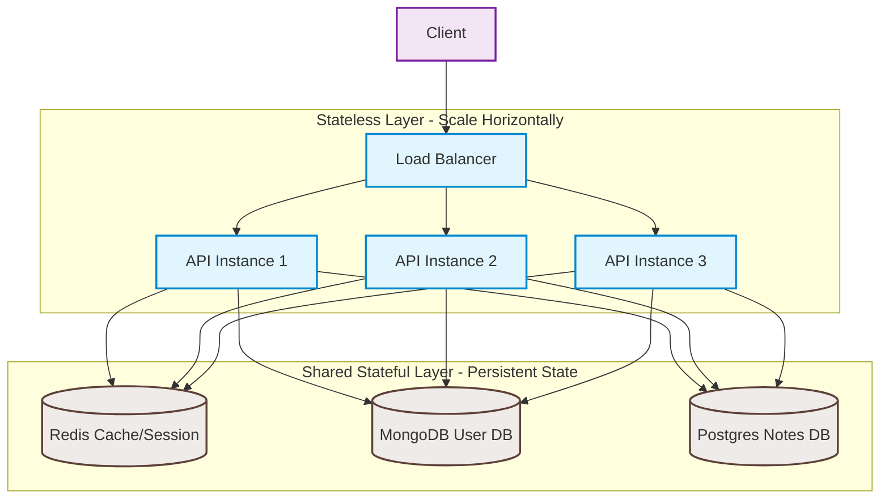

# Notes API — High Availability Deployment & Load Balancing

## Load Balancing Workload Analysis

For our Notes API, **Least Connections** load balancing makes more sense than Round Robin. 

Our workload is **not uniform in cost**. While simple note retrievals (`GET /notes`) or health check endpoints are extremely fast and lightweight, other operations are highly resource-intensive. For example, password hashing using bcrypt or argon2 during user registration (`POST /users`) and login (`POST /users/login`) consumes significant CPU time (often 50–100ms+ of blocking CPU execution). If we used Round Robin, a single API instance could get bottlenecked by receiving multiple concurrent password hashing or complex database queries in a row, while other instances sit idle. Least Connections ensures that incoming requests are dynamically routed to the instance that is currently processing the fewest active requests, resulting in better utilization and lower latency spike rates under variable workloads.

---

## Architecture Diagram

### ASCII Diagram

```text
                        ┌───────────┐
                        │  Client   │
                        └─────┬─────┘
                              │
                              ▼
                    ┌───────────────────┐
                    │   Load Balancer   │ (Stateless routing)
                    └─────────┬─────────┘
                              │
              ┌───────────────┼───────────────┐
              ▼               ▼               ▼
        ┌───────────┐   ┌───────────┐   ┌───────────┐
        │   API 1   │   │   API 2   │   │   API 3   │  <-- Stateless Instances
        │(Stateless)│   │(Stateless)│   │(Stateless)│      (Can scale horizontally)
        └─────┬─────┘   └─────┬─────┘   └─────┬─────┘
              │               │               │
              ├───────┬───────┼───────┬───────┤
              │       │       │       │       │
              ▼       ▼       ▼       ▼       ▼
           ┌─────┐ ┌───────────┐ ┌───────────┐
           │Redis│ │ MongoDB   │ │ Postgres  │         <-- Shared Stateful Layer
           │Cache│ │ (User DB) │ │ (Notes DB)│
           └─────┘ └───────────┘ └───────────┘
```

### Mermaid Diagram



---

## State Classification

*   **Stateless Components:**
    *   **Client & Load Balancer:** Route traffic dynamically without storing session context or application state.
    *   **API Instances (1, 2, and 3):** Contain application logic only. They do not store user sessions, upload files locally, or maintain local database connections that store unique state. Any instance can handle any incoming request.
*   **Shared & Stateful Components:**
    *   **MongoDB:** Stores persistent user profile information (used for authentication, registration, profiles) and must be accessible by all API instances.
    *   **PostgreSQL:** Stores persistent notes data and relationships, synced and queried by all API instances.
    *   **Redis:** A shared memory store used for caching notes data and session tokens, allowing stateless API instances to verify user sessions and retrieve fast-lookup data consistently.
